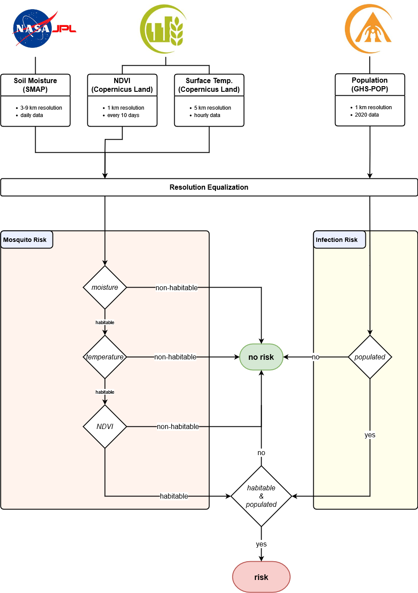

# Tropical Mosquito Monitor
An application to monitor the risk of mosquito-borne infection by 
analysis of **soil moisture**, **NDVI**, **surface temperature** and **population density**.

Data will be drawn from
- Copernicus Services
  - Land Monitoring Service
  - Emergency Management Service 
- the SMAP mission by JPL

## Workflow

## Data
Example data for Nigeria:
- soil moisture (top left)
- land surface temperature (bottom left)
- NDVI (top right)
- population overlayed (bottom right)

## Results
The final risk map indicates a discrete risk rating from 1 (green) to 5 (red). Dry desert areas show a smaller risk due to infavourable breeding conditions for mosquitoes. The Niger basin area experiences the largest risk as a result of soil moisture and large population.

